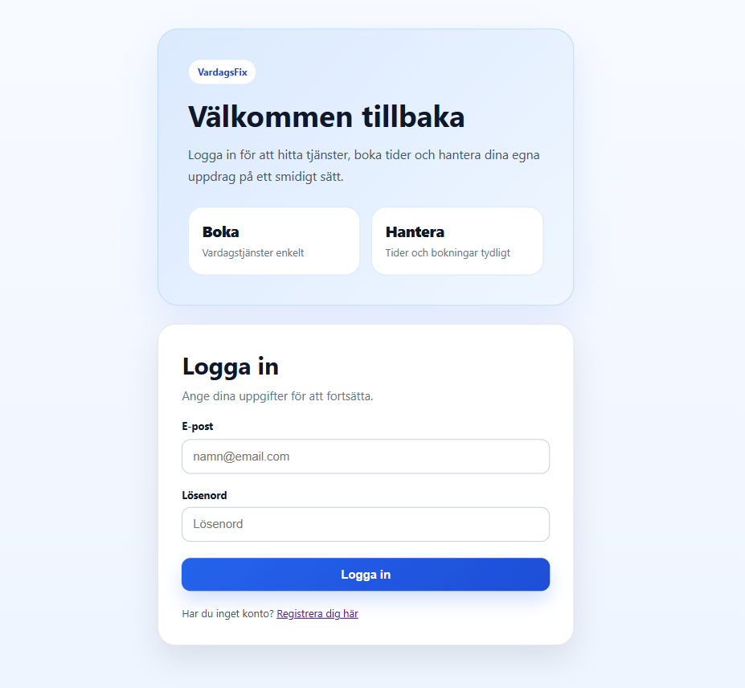
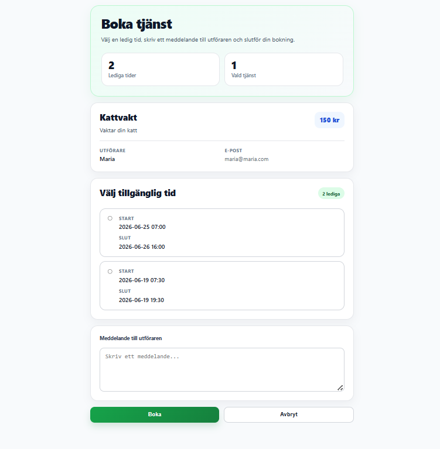

# Utveckling och testning av en fullstack-baserad bokningsapplikation för vardagstjänster

## Sammanfattning (Abstract)

This thesis describes the development and testing of a fullstack booking application for everyday services. The project addresses the need for a structured digital solution where users can create services, define available time slots, book services from other users, and manage bookings through a web interface.

The purpose of the work was to develop a booking application and investigate how automated testing can be used to ensure correct and reliable booking logic. The application was implemented with Java and Spring Boot in the backend, React and TypeScript in the frontend, and PostgreSQL as the database. Authentication was implemented using JSON Web Tokens (JWT).

The project used an iterative development process where functionality was implemented, tested, and improved step by step. The test strategy included unit tests for backend business logic, controller tests for API responses, integration tests for complete flows involving database and JWT authentication, and frontend tests using Vitest and React Testing Library.

The result is a functioning prototype where users can register, log in, create services, manage available time slots, book services, cancel bookings, and view active or archived bookings. The automated tests verify central rules such as preventing double bookings, rejecting invalid time intervals, blocking users from booking their own services, and protecting endpoints from unauthorized access.

The conclusion is that a combination of unit tests, controller tests, integration tests, and frontend tests can provide a stronger basis for verifying booking logic and system reliability in a fullstack application.

**Nyckelord:** _Fullstack Development, Booking System, Spring Boot, Automated Testing, JWT_

---

## Förkortningar och Begrepp

| Term/Förkortning | Förklaring |
| --- | --- |
| API | Application Programming Interface, ett gränssnitt för kommunikation mellan mjukvarusystem |
| Backend | Den del av applikationen som hanterar logik, databas och API |
| Controller | Klass i backend som tar emot HTTP-anrop och returnerar respons |
| CRUD | Create, Read, Update, Delete |
| DTO | Data Transfer Object, objekt som används för att skicka data mellan olika lager |
| Frontend | Den del av applikationen som användaren interagerar med i webbläsaren |
| HTTP | Hypertext Transfer Protocol |
| Integrationstest | Test som verifierar att flera delar av systemet fungerar tillsammans |
| JWT | JSON Web Token, tokenbaserad autentisering |
| MockMvc | Spring-verktyg för att testa controllers och HTTP-flöden |
| React Testing Library | Testbibliotek för att testa React-komponenter ur användarperspektiv |
| Repository | Lager i backend som ansvarar för databasåtkomst |
| REST | Representational State Transfer, arkitekturstil för webbaserade API:er |
| Service | Lager i backend där affärslogik placeras |
| Unit test | Enhetstest som testar en avgränsad del av systemet |
| Vitest | Testramverk för frontendtester i Vite/React-projekt |

---

## 1. Inledning

### 1.1 Bakgrund

Digitala plattformar för att boka tjänster har blivit allt vanligare inom flera områden, exempelvis transport, boende och hushållsnära tjänster. Samtidigt sker många enklare vardagstjänster fortfarande informellt genom sociala medier, chattgrupper eller muntliga överenskommelser. Sådana lösningar saknar ofta struktur, sökbarhet och tydlig hantering av bokningar.

En central utmaning i ett bokningssystem är att säkerställa att bokningslogiken fungerar korrekt. Systemet behöver exempelvis förhindra att en tid kan bokas två gånger, att användare bokar sina egna tjänster eller att tider i det förflutna används som tillgängliga bokningstider. Utöver detta behöver systemet hantera autentisering och behörighet så att användare endast kan ändra eller ta bort sina egna resurser.

För att undersöka detta utvecklas i detta examensarbete en fullstack-applikation för bokning av vardagstjänster. Applikationen gör det möjligt för användare att registrera sig, logga in, skapa tjänster, lägga till tillgängliga tider samt boka och hantera bokningar.

Arbetet fokuserar inte enbart på implementationen av systemet, utan även på hur automatiserad testning kan användas för att verifiera korrekt funktionalitet. Testningen omfattar backendens affärslogik, API-lager, integration mellan databas och autentisering samt frontendens användarflöden.

### 1.2 Syfte

Syftet med examensarbetet är att utveckla en fullstack-baserad bokningsapplikation för vardagstjänster och undersöka hur en kombination av automatiserade tester kan användas för att säkerställa korrekt och tillförlitlig bokningslogik.

Arbetet fokuserar särskilt på att verifiera centrala affärsregler, såsom att förhindra dubbelbokningar, ogiltiga tidsintervall, bokning av egna tjänster och obehörig åtkomst till andra användares resurser. Ett ytterligare syfte är att undersöka hur backendtester och frontendtester kan komplettera varandra i en fullstack-applikation.


### 1.3 Frågeställningar

Huvudfrågeställningen för arbetet är:

**Hur kan automatiserad testning användas för att säkerställa korrekt och tillförlitlig bokningslogik i en fullstack-baserad bokningsapplikation?**

Delfrågor:

- Hur kan enhetstester verifiera centrala affärsregler i bokningslogiken?
- Hur kan controllertester verifiera att API-lagret returnerar korrekt respons och datamappning?
- Hur kan integrationstester säkerställa att bokningsflöden fungerar korrekt tillsammans med databas, API och JWT-autentisering?
- Hur kan frontendtester verifiera att användargränssnittet hanterar bokning, validering och felmeddelanden korrekt?
- Hur kompletterar olika testnivåer varandra för att skapa en mer tillförlitlig applikation?

### 1.4 Avgränsningar

Projektet fokuserar på kärnfunktionalitet för en bokningsplattform. Följande avgränsningar har gjorts:

- Betalningslösningar och ekonomiska transaktioner ingår inte.
- Realtidsfunktioner, exempelvis notifikationer via WebSocket, implementeras inte.
- Systemet optimeras inte för hög belastning eller produktion i stor skala.
- Säkerheten fokuserar på JWT-autentisering och grundläggande behörighetskontroller.
- Avancerade säkerhetsfunktioner som refresh tokens, rollbaserad åtkomstkontroll och penetrationstestning ingår inte.
- Testningen omfattar inte prestandatester eller fullständiga end-to-end-tester i riktig webbläsare.
- Frontend-utvecklingen fokuserar på funktionalitet, tydlig återkoppling och användarflöden snarare än avancerad grafisk design.

### 1.5 Metodöversikt

Arbetet har genomförts som ett utvecklingsprojekt med en iterativ arbetsmetod. Funktionalitet implementerades stegvis och verifierades löpande genom manuell testning, medan den automatiserade testsviten byggdes ut mer omfattande i ett senare skede.

Backend och frontend har utvecklats separat och integrerats via ett REST-baserat API. Backend har implementerats med Java och Spring Boot, medan frontend har utvecklats med React och TypeScript.

Testningen har genomförts på flera nivåer. Backend har testats med enhetstester för affärslogik, controllertester för API-respons och integrationstester för kompletta flöden med databas och JWT-autentisering. Frontend har testats med Vitest och React Testing Library för att verifiera användarflöden, validering, API-anrop och komponentbeteenden.

---

## 2. Teoretisk Grund och Relaterat Arbete

### 2.1 Tekniska Koncept


Projektet bygger på flera centrala tekniska koncept inom modern webbutveckling: klient-server-arkitektur, REST-baserade API:er, JWT-baserad autentisering, lagerbaserad backend-arkitektur, komponentbaserad frontend-utveckling och automatiserad testning.

Applikationen är uppbyggd enligt en klient-server-modell där frontend och backend är separerade. Frontend ansvarar för presentation och användarinteraktion, medan backend ansvarar för affärslogik, autentisering, datalagring och API.

REST används för kommunikationen mellan frontend och backend. REST bygger bland annat på klient–server-arkitektur och stateless kommunikation [1]. I projektet används HTTP-metoderna GET, POST, PUT, PATCH och DELETE för att hantera resurser som användare, tjänster, tillgängliga tider och bokningar.

För autentisering används JSON Web Tokens (JWT). JWT är en standard för att representera och överföra claims mellan två parter [2]. I detta projekt används JWT för tokenbaserad autentisering, för att skydda endpoints och för att identifiera vilken användare som gör ett anrop.

Backend är strukturerad i separata lager:

- Controllers tar emot HTTP-anrop och returnerar respons.
- Services innehåller affärslogik.
- Repositories hanterar databasåtkomst.
- DTO-klasser används för att separera inkommande och utgående data från interna entiteter.

Frontend är byggd med React och TypeScript. React möjliggör komponentbaserad utveckling där användargränssnitt delas upp i återanvändbara delar. TypeScript används för att ge statisk typning och minska risken för fel vid utveckling.

Automatiserad testning är en central del av arbetet. Enhetstester används för att testa avgränsad logik, controllertester används för att verifiera API-lagret, integrationstester används för att verifiera samspel mellan flera delar av systemet och frontendtester används för att verifiera användarflöden.

### 2.2 Befintlig Forskning och Lösningar

Det finns flera etablerade digitala plattformar för bokning och förmedling av tjänster. Tiptapp är en plattform som kopplar samman användare med hjälpare för bland annat flytt, leverans och återvinning [3]. Yepstr förmedlar hushållsnära tjänster som barnpassning, läxhjälp och trädgårdsarbete, med ungdomar som utförare [4]. Blocket är en bred annonsplattform där användare kan annonsera, köpa och sälja både varor och tjänster [5]. Internationellt används Bark.com för att hitta tjänsteleverantörer och begära offerter inom bland annat hushållstjänster, hälsa och företagstjänster [6].
 
De tjänsteförmedlande plattformarna behöver hantera användaridentitet och förmedling av tjänster, medan bokningsorienterade lösningar även behöver hantera tillgänglighet och bokningsregler. Kommersiella system kan dessutom innehålla funktioner som betalningslösningar, användarbetyg, notifikationer och realtidsuppdateringar.
 
Vardagsfix skiljer sig från dessa lösningar i syfte och omfång. Projektet är en prototyp utan betalningsfunktioner, och fokuserar specifikt på hur bokningslogik och säkerhetsrelaterade flöden kan verifieras genom automatiserade tester. Medan kommersiella plattformar prioriterar skalbarhet och användarupplevelse i produktionsmiljö, är det primära bidraget i detta arbete att undersöka hur testning kan användas för att säkerställa korrekthet i de affärsregler som är centrala i alla bokningssystem: att förhindra dubbelbokningar, skydda resurser från obehörig åtkomst och validera tidsintervall.


### 2.3 Teknisk/Teoretisk Jämförelse

#### Val av autentiseringsstrategi

För autentisering valdes JSON Web Tokens (JWT) istället för sessionsbaserad autentisering. Sessionsbaserad autentisering innebär att servern lagrar sessionsinformation och kopplar varje inkommande anrop till ett sessionsobjekt i minnet eller databasen. JWT möjliggör en stateless lösning där all nödvändig information är inbäddad i tokenen och skickas med varje skyddat anrop. Detta passar väl för en REST-baserad arkitektur där backend inte behöver hålla serverbaserad sessionsdata [2]. En nackdel med en helt stateless JWT-lösning är att en utfärdad token normalt förblir giltig tills den löper ut, om inte en serverbaserad mekanism såsom en blockeringslista används. I detta projekt används en förenklad implementation utan refresh tokens, vilket fungerar för prototypens syfte men inte vore tillräckligt i en produktionsmiljö.

#### Val av API-arkitektur
 
För API-design valdes REST framför GraphQL. REST ansågs lämpligt eftersom projektets resurser, användare, tjänster, tillgängliga tider och bokningar är tydligt avgränsade och kan representeras naturligt som CRUD-endpoints. GraphQL hade kunnat erbjuda mer flexibel datainhämtning och minska antalet anrop för komplexa vyer, men hade också ökat komplexiteten i både backend-implementation och klientkod. Eftersom projektet fokuserar på korrekthet och testbarhet snarare än datahämtningseffektivitet var REST ett välmotiverat val.
 
#### Val av frontend-ramverk och typning
 
För frontend valdes React med TypeScript. React möjliggör komponentbaserad utveckling där gränssnittet delas upp i återanvändbara delar, vilket underlättar testning av isolerade komponenter med React Testing Library. TypeScript lades till för statisk typning, vilket minskar risken för typrelaterade fel och förbättrar kodens läsbarhet. Vue.js erbjuder också en komponentbaserad modell och hade kunnat vara ett alternativ, medan Angular hade inneburit en mer omfattande ramverksstruktur och en högre inlärningströskel för detta projekt. React valdes också delvis för att det är det ramverk som användes under utbildningen och i praktiken, vilket minskade risken för onödiga inlärningsbarriärer.
 
#### Val av teststrategi och testverktyg
 
Teststrategin utformades utifrån konceptet med en testpyramid, där ett stort antal snabba enhetstester bildar basen, ett lager av integrationstester täcker samspelet mellan komponenter, och ett mindre antal bredare tester täcker fullständiga användarflöden [7]. I backend användes JUnit 5 som testramverk. Mockito användes för att mocka beroenden i enhets- och controllertester, vilket möjliggjorde isolerad testning av affärslogik utan databasanrop. Mockito användes för att mocka beroenden i enhets- och controllertester, vilket möjliggör isolerad testning av affärslogik utan databasanrop. För integrationstester valdes H2 som in-memory-databas, vilket möjliggör realistiska databasanrop utan att en extern databas behöver köras under testning [8].
 
I frontend valdes Vitest eftersom det bygger på Vite och kan återanvända projektets Vite-konfiguration och transform-pipeline [9]. React Testing Library valdes för att testa komponenter ur ett användarperspektiv snarare än att testa interna implementationsdetaljer, vilket minskar risken att tester bryts vid refaktorering [10].

---

## 3. Metod och Genomförande

### 3.1 Övergripande Arbetsgång

Projektet genomfördes iterativt. Arbetet började med planering av systemets datamodell och grundläggande arkitektur. Därefter utvecklades backend-funktionalitet för användare, autentisering, tjänster och bokningar.

När backendens grundfunktionalitet var på plats utvecklades frontend-applikationen. Frontend integrerades successivt med backend genom API-anrop. Funktioner som inloggning, registrering, skapande av tjänster, bokning, avbokning och visning av data implementerades stegvis.

Under arbetets gång förändrades fokus från enbart implementation till att mer tydligt undersöka testningens roll i att säkerställa bokningslogik. Därför kompletterades projektet med en mer omfattande testsvit i både backend och frontend.

### 3.2 Verktyg och Tekniker

Backend utvecklades med:

- Java
- Spring Boot
- Spring Web
- Spring Security
- Spring Data JPA
- PostgreSQL
- H2 för integrationstester
- JWT via biblioteket JJWT
- Gradle

Frontend utvecklades med:

- React
- TypeScript
- Vite
- axios
- React Router

Testning genomfördes med:

- JUnit för backendtester
- Mockito för mockning i enhetstester och controllertester
- Spring Boot Test för integrationstester
- MockMvc för att testa HTTP-flöden i backend
- H2 som testdatabas vid integrationstester
- Vitest för frontendtester
- React Testing Library för testning av användargränssnitt och komponenter

Versionshantering skedde med Git och GitHub.

### 3.3 Datainsamling och Analys

I detta utvecklingsprojekt har datainsamling skett genom implementation, testning och analys av systemets funktionalitet. Eftersom arbetet är praktiskt inriktat består underlaget inte av traditionell datainsamling med intervjuer eller enkäter, utan av resultat från utvecklingsprocessen och automatiserade tester.
 
Krav på systemet identifierades utifrån projektets problemområde: att skapa en strukturerad lösning för bokning av vardagstjänster. De centrala kraven var att användare ska kunna registrera sig, logga in, skapa tjänster, lägga till tillgängliga tider, boka andra användares tjänster och hantera bokningar.
 
Utifrån dessa krav utformades systemets datamodell med fyra centrala domänmodeller: `AppUser`, `TaskService`, `AvailableSlot` och `Booking`. En användare kan skapa flera tjänster. Varje tjänst är kopplad till en ägare och kan innehålla flera tillgängliga tider. En bokning kopplar samman en användare med en specifik tjänst och en vald tillgänglig tid.

Figur 1 visar systemets lagerindelning samt relationerna mellan de centrala domänmodellerna.


 
Modellen `AvailableSlot` används för att representera bokningsbara tidsintervall. Denna separation möjliggör tydlig kontroll över vilka tider en tjänsteägare erbjuder och vilka bokningar som faktiskt existerar, och visade sig vara central för att förhindra dubbelbokningar och tydligt markera om en tid är bokad eller ledig.
 
Backend analyserades utifrån en lagerbaserad struktur med controllers, services och repositories, vilket möjliggör testning av varje lager fokuserat och isolerat. Frontend analyserades utifrån användarflöden med centrala vyer för inloggning, registrering, visning av tjänster, skapande av tjänster, bokning och hantering av egna tjänster.
 
Testresultaten användes som det primära underlaget för att bedöma om systemet uppfyller de funktionella kraven och de definierade affärsreglerna.

### 3.4 Kvalitetssäkring

För att säkerställa kvaliteten i systemet användes flera former av automatiserad testning. Testningen delades upp i olika nivåer för att verifiera både isolerad logik och kompletta användarflöden.

I backend implementerades enhetstester för service-lagret. Dessa tester fokuserade på affärslogik, exempelvis att en användare inte kan boka sin egen tjänst, att redan bokade tider inte kan bokas igen, att ogiltiga tidsintervall nekas och att avbokning frigör en bokad tid.

Controllertester användes för att verifiera API-lagret. Dessa tester kontrollerade att controllers returnerar korrekt HTTP-status och korrekt JSON-struktur. Exempelvis testades responsen från endpoints för autentisering, tjänster och bokningar.

Integrationstester användes för att testa flera delar av systemet tillsammans. Dessa tester kördes med Spring Boot, MockMvc och H2-databas. Integrationstesterna verifierade bland annat att skyddade endpoints kräver JWT, att obehöriga användare inte kan ändra eller ta bort andra användares tjänster, att överlappande tider nekas och att dubbelbokningar förhindras.

I frontend användes Vitest och React Testing Library. Frontendtesterna verifierade användarflöden och komponentbeteenden, exempelvis att användaren kan skapa tjänster, boka tider, få felmeddelanden vid ogiltig input och bekräfta borttagning via dialogrutor.

Kodstrukturen bidrog också till kvalitetssäkring. Backend delades upp i controllers, services och repositories, vilket gjorde det möjligt att testa varje lager mer fokuserat. Frontend delades upp i sidor, API-filer, komponenter och hjälpfunktioner, vilket gjorde koden mer överskådlig och lättare att testa.

Felhantering implementerades i backend genom en global exception handler som returnerar tydliga felmeddelanden och HTTP-statuskoder. I frontend används toast-meddelanden och bekräftelsedialoger för att ge användaren tydlig återkoppling.

Genom att kombinera flera testnivåer kunde systemets tillförlitlighet stärkas. Enhetstesterna gav snabb återkoppling på affärslogik, controllertesterna verifierade API-respons, integrationstesterna säkerställde att backendens delar fungerade tillsammans och frontendtesterna verifierade användarens perspektiv.

---

## 4. Resultat

### 4.1 Huvudresultat

Resultatet av projektet är en fullstack-applikation, Vardagsfix, för bokning av vardagstjänster. Användare kan via ett webbgränssnitt registrera sig, logga in, skapa tjänster med tillgängliga tider, boka andra användares tjänster samt hantera och avboka befintliga bokningar.

Figur 2,3,4 visar applikationens inloggningssida, tjänstöversikt, där användaren kan se tillgängliga tider och aktuell bokningsstatus samt sidan där man hittar sina egna tjänster som en användare har lagt upp.

 
 

 
Systemet implementerar autentisering med JSON Web Tokens (JWT), vilket möjliggör skyddade endpoints och identifiering av inloggad användare vid varje anrop. Backend är strukturerad i tre lager: controllers, services och repositories och kommunicerar med frontend via ett REST-baserat API. PostgreSQL används som ordinarie databas i applikationens körmiljö, medan H2 används som in-memory-databas under integrationstester.
 
Bokningslogiken säkerställer att:
 
- en användare inte kan boka sin egen tjänst
- en redan bokad tid inte kan bokas igen
- tider i det förflutna inte kan bokas
- överlappande tider inte kan skapas för samma tjänst
- avbokning av en bokning frigör den tillhörande tillgängliga tiden

### 4.2 Detaljerade Fynd

Samtliga 110 automatiserade tester passerar. Testsviten är fördelad på fyra nivåer:
 
**Enhetstester (backend) — 38 tester**
 
Enhetstesterna täcker service-lagret och är isolerade från databas och externa beroenden via Mockito. BookingServiceTest innehåller 17 tester som verifierar centrala affärsregler för bokning och avbokning. ServiceServiceTest innehåller 17 tester som täcker skapande, uppdatering och borttagning av tjänster, inklusive validering av tidsintervall. AuthServiceTest innehåller 4 tester för registrering, lösenordskodning, lyckad inloggning och felaktiga inloggningsuppgifter. Nedan visas ett representativt exempel där testet verifierar att en bokning inte kan skapas för en redan bokad tid:
 
```java
@Test
void createBooking_shouldThrowIllegalArgumentException_whenSlotAlreadyBooked() {
    availableSlot.setBooked(true);
 
    when(userRepository.findByEmail("olle@test.com")).thenReturn(Optional.of(booker));
    when(serviceRepository.findById(10L)).thenReturn(Optional.of(taskService));
    when(availableSlotRepository.findById(100L)).thenReturn(Optional.of(availableSlot));
 
    assertThrows(
        IllegalArgumentException.class,
        () -> bookingService.createBooking(request, "olle@test.com")
    );
 
    verify(bookingRepository, never()).save(any());
}
```
 
Testet verifierar inte bara att rätt undantag kastas, utan kontrollerar även att `bookingRepository.save()` aldrig anropas — det vill säga att ingen bokning sparas vid ogiltig indata.
 
**Controllertester (backend) — 11 tester**
 
Controllertesterna använder MockMvc för att verifiera HTTP-lagrets beteende utan att starta en fullständig serverinstans. `BookingControllerTest` (4 tester), `ServiceControllerTest` (5 tester) och `AuthControllerTest` (2 tester) kontrollerar att endpoints returnerar korrekt HTTP-statuskod, korrekt JSON-struktur och att rätt service-metod anropas. Beroenden till service-lagret mockas med Mockito, vilket innebär att controllertesterna testar HTTP-mappning och datamappning isolerat från affärslogiken.
 
**Integrationstester (backend) — 9 tester**
 
Åtta tester i BackendApiIntegrationTest startar en fullständig Spring Boot-kontext med en H2-databas och testar kompletta HTTP-flöden inklusive JWT-autentisering. Testerna registrerar och loggar in riktiga användare, skapar tjänster och bokningar via HTTP-anrop och verifierar att systemet som helhet beter sig korrekt. Därutöver innehåller VardagsfixApplicationTests ett contextLoads-test som verifierar att Spring-kontexten kan startas med testkonfigurationen. Följande tabell sammanfattar de åtta API-scenarier som täcks:
 
| Testfall | Förväntat resultat |
|---|---|
| Skyddad endpoint utan JWT-token | 403 Forbidden |
| Skapa tjänst med överlappande tider | 400 Bad Request |
| Skapa tjänst med tid i det förflutna | 400 Bad Request |
| Uppdatera annans tjänst | 403 Forbidden |
| Ta bort annans tjänst | 403 Forbidden |
| Skapa giltig bokning | 200 OK, status BOOKED |
| Boka sin egen tjänst | 403 Forbidden |
| Dubbelboka en redan bokad tid | 400 Bad Request |
 
Integrationstesterna är de enda tester som verifierar samspelet mellan JWT-autentisering, databasoperationer och affärslogik i ett sammanhängande flöde. Att en obehörig uppdatering av en tjänst returnerar 403 på grund av den faktiska säkerhetskonfigurationen, och inte på grund av hur mockar har konfigurerats, kan endast bekräftas på denna testnivå.

Figur 5 visar resultatet från backendens automatiserade testkörning. Samtliga 58 backendtester passerade utan misslyckade tester.


 
**Frontendtester — 52 tester**
 
Frontendtesterna är skrivna med Vitest och React Testing Library och omfattar 11 testfiler: två API-filer, sju sidkomponenter och två UI-komponenter. Testerna är fördelade på API-lager (9 tester), sidkomponenter (32 tester) och UI-komponenter (11 tester för Toast och ConfirmDialog).
 
Frontendtesterna verifierar bland annat att:
 
- `CreateBookingPage` filtrerar bort redan bokade tider och tider i det förflutna ur det bokningsbara urvalet
- `CreateServicePage` förhindrar att överlappande tider, tider i det förflutna och tider där sluttid är före starttid läggs till
- `MyServicesPage` visar bekräftelsedialog innan borttagning och uppdaterar listan efter lyckad borttagning
- `LoginPage` sparar JWT-token vid lyckad inloggning och visar felmeddelande vid felaktiga uppgifter
- `ServicesPage` markerar användarens egna tjänster med "Din tjänst" och döljer bokningsknappen
Nedan visas ett exempel från `CreateBookingPage_test.tsx` som verifierar att filtreringslogiken fungerar korrekt ur användarperspektiv:
 
```typescript
test("visar endast framtida och obokade tider", async () => {
    mockedGetAllServices.mockResolvedValue([serviceWithMixedSlots]);
    renderPage();
 
    expect(await screen.findByText("Hundpromenad")).toBeInTheDocument();
    expect(screen.getByText("1 lediga")).toBeInTheDocument();
 
    // Verifierar att framtida obokad tid visas
    expect(screen.getByText("2035-05-01 10:00")).toBeInTheDocument();
 
    // Verifierar att bokad och passerad tid inte visas
    expect(screen.queryByText(/2020-05-01/)).not.toBeInTheDocument();
    expect(screen.queryByText("2035-05-01 12:00")).not.toBeInTheDocument();
});
```

Figur 6 visar resultatet från frontendens automatiserade testkörning. Samtliga 52 frontendtester passerade utan misslyckade tester.


### 4.3 Oväntade Resultat

Under utvecklingen visade sig bokningslogiken vara mer komplex än initialt förväntat. Att en bokning kopplar samman fyra entiteter: `AppUser`, `TaskService`, `AvailableSlot` och `Booking` — innebar att varje bokningsoperation behöver validera relationer och tillstånd i flera steg. Testningen identifierade ett flertal edge cases som inte var uppenbara i designfasen, till exempel att avbokning måste hantera fallet då en bokning saknar en kopplad `AvailableSlot`.
 
En annan insikt var att frontend-testerna identifierade behov av tydligare tillståndshantering i användargränssnittet. Exempelvis behövde systemet visa "Fullbokad" och inaktivera bokningsknappar när inga framtida lediga tider finns, vilket inte enbart kan hanteras på backend utan kräver explicit logik i frontend.

---

## 5. Diskussion

### 5.1 Analys av Resultat

#### Svar på frågeställningarna
 
**Hur kan enhetstester verifiera centrala affärsregler i bokningslogiken?**
 
Enhetstesterna i `BookingServiceTest` och `ServiceServiceTest` visar att service-lagret är effektivt att testa isolerat via Mockito. Genom att mocka repositories kan varje affärsregel verifieras utan databas, vilket ger snabb återkoppling. De 17 testerna i `BookingServiceTest` täcker åtta distinkta felscenarier vid bokning samt fyra vid avbokning. En viktig insikt är att testerna inte bara verifierar att rätt undantag kastas, utan även att sidoeffekter uteblir — exempelvis att `bookingRepository.save()` aldrig anropas vid ogiltig indata. Detta stärker tillförlitligheten eftersom det säkerställer att ett fel inte bara ger rätt felmeddelande, utan också lämnar systemet i korrekt tillstånd.
 
**Hur kan controllertester verifiera att API-lagret returnerar korrekt respons och datamappning?**
 
Controllertesterna visar att MockMvc är ett effektivt verktyg för att verifiera HTTP-lagret isolerat. Testerna kontrollerar statuskoder, JSON-struktur och att rätt metoder i service-lagret anropas med rätt parametrar. En begränsning är att controllertesterna med `@WebMvcTest` och mockade service-beroenden inte kan verifiera att JSON-serialiseringen av faktiska databas-entiteter fungerar korrekt, eftersom returvärden är hårdkodade mock-objekt. Detta är ett skäl till att integrationstester behövs som komplement.
 
**Hur kan integrationstester säkerställa att bokningsflöden fungerar korrekt tillsammans med databas, API och JWT-autentisering?**
 
Integrationstesterna i `BackendApiIntegrationTest` visar att det är möjligt att testa kompletta flöden med en H2-databas utan att kräva en extern databasinstans. De åtta testscenarierna täcker de viktigaste säkerhets- och valideringsreglerna i ett realistiskt flöde. En central insikt är att integrationstesterna avslöjar problem som inte syns på lägre nivåer, exempelvis att JWT-filtret korrekt blockerar obehöriga anrop, vilket inte kan verifieras av enhetstester eller controllertester med inaktiverade security-filter.
 
**Hur kan frontendtester verifiera att användargränssnittet hanterar bokning, validering och felmeddelanden korrekt?**
 
Frontendtesterna med Vitest och React Testing Library visar att det är möjligt att verifiera användarflöden utan att starta en riktig webbläsare. Testerna bekräftar att filtreringslogiken för tider fungerar i gränssnittet, att felmeddelanden visas vid ogiltig input och att API-anrop skickas med korrekt data. En viktig egenskap hos React Testing Library är att det testar komponenter ur ett användarperspektiv, via synliga element och roller snarare än interna implementationsdetaljer, vilket gör testerna mer motståndskraftiga mot refaktorering.
 
**Hur kompletterar olika testnivåer varandra?**
 
Resultatet visar tydligt att de fyra testnivåerna täcker olika aspekter av systemet och inte är utbytbara. Enhetstester ger bred täckning av affärslogik med hög hastighet. Controllertester verifierar HTTP-mappning. Integrationstester bekräftar att systemets delar fungerar tillsammans med riktig autentisering och databas. Frontendtester verifierar det som backend inte kan se: hur data presenteras och filtreras i gränssnittet. Kombinationen ger ett mer komplett skyddsnät än vad någon enskild nivå skulle kunna ge.
 
#### Analys av systemets design
 
Backendens lagerstruktur visade sig vara ett effektivt designval för testbarhet. Genom att placera affärslogik i service-lagret, separerat från HTTP-hantering i controllers och databasåtkomst i repositories, kunde varje del testas isolerat med lämpliga verktyg.
 
Datamodellen med `AvailableSlot` som separat entitet visade sig ha stor påverkan på systemets robusthet. Designvalet möjliggjorde tydlig kontroll av bokningsbara tider och förenkling av dubbelbokningsskyddet. En alternativ design utan denna entitet, där tider lagrats direkt i bokningsobjektet hade gjort det svårare att skilja mellan erbjudna och bokade tider samt att visa lediga tider i gränssnittet.
 
Jämfört med etablerade plattformar som Tipptapp och Yepstr är Vardagsfix en prototyp utan produktionskrav. Resultatet visar dock att kärnfunktionaliteten i ett bokningssystem kan implementeras med korrekt logik och verifieras med automatiserade tester, vilket är det primära syftet med projektet.
 
### 5.2 Reflektion över Metod

Den iterativa utvecklingsmetoden visade sig vara väl lämpad för projektet. Genom att implementera funktionalitet stegvis och testa kontinuerligt identifierades problem tidigt. Exempelvis avslöjades behovet av en separat `AvailableSlot`-entitet under ett tidigt skede, innan frontend hade integrerats fullt ut, vilket begränsade mängden omarbetning.
 
En styrka i metoden var att frontend integrerades successivt samtidigt som backend fortsatte att förfinas. Detta gjorde det tydligt att designbeslut i backend, exempelvis hur felmeddelanden struktureras, direkt påverkar frontendimplementationen och testbarheten.
 
En tydlig svaghet i arbetsprocessen var att automatiserad testning inte prioriterades från projektets start. Testsviten byggdes ut i ett senare skede, vilket innebär att det är möjligt att problem som åtgärdades under tidig utveckling inte fångas av de slutliga testerna. Hade testning tillämpats tidigare i enlighet med test-driven development [11] hade testerna kunnat styra implementationen av affärsreglerna i stället för att huvudsakligen läggas till i efterhand. Detta är en metodologisk begränsning som påverkar hur väl testsviten representerar hela utvecklingsprocessen.
 
En annan reflektion rör val av metod för datainsamling. Projektet utvärderas uteslutande utifrån om tester passerar, utan exekvering av kodtäckningsmätning via exempelvis JaCoCo. En sådan mätning hade gett ett mer precist underlag för att bedöma vilka kodvägar som faktiskt täcks av testerna, och hade identifierat blinda fläckar i testsviten.

### 5.3 Begränsningar och Kritisk Granskning

Projektet har flera begränsningar som påverkar resultatets tillförlitlighet och generaliserbarhet.
 
En metodologisk begränsning är avsaknaden av kodtäckningsmätning. Utan ett mätvärde för täckningsgrad är det inte möjligt att kvantifiera hur stor del av koden som faktiskt verifieras av testerna. Det är möjligt att delar av felhanteringen eller edge cases i repository-lagret inte täcks av nuvarande tester.
 
Säkerhetsmässigt är implementationen grundläggande. JWT-autentisering skyddar endpoints, men funktioner som refresh tokens, token-invalidering och rollbaserad åtkomstkontroll saknas. Detta innebär att systemet inte är lämpligt för produktionsanvändning utan ytterligare säkerhetsarbete.
 
En teknisk begränsning är att integrationstesterna körs sekventiellt mot en delad in-memory-databas, vilket kräver manuell databasnollställning (`clearDatabase()`) mellan tester. Detta är sårbart för testordningsberoenden och skulle kunna lösas med `@Transactional`-baserad återställning eller isolerade databasinstanser per test.
 
Testningen täcker inte end-to-end-scenarion i en riktig webbläsare. Frontendtesterna körs i en simulerad DOM-miljö (jsdom) och kan inte verifiera renderingsproblem, CSS-beroende interaktioner eller beteenden som är specifika för enskilda webbläsare.

### 5.4 Bredare Perspektiv

Projektet visar hur moderna webbutvecklingstekniker kan användas för att skapa en strukturerad lösning för hantering av vardagstjänster. Detta har praktisk relevans i en kontext där många tjänster fortfarande hanteras informellt, exempelvis via sociala medier.

Ur ett tekniskt perspektiv illustrerar arbetet hur en fullstack-arkitektur kan byggas upp med tydlig separation mellan frontend och backend. Det visar även hur olika teknologier – såsom Spring Boot, React och JWT – kan integreras för att skapa en sammanhängande applikation.

Projektet belyser också vikten av att kombinera affärslogik och användarupplevelse. Ett system kan vara tekniskt korrekt, men utan tydlig presentation riskerar användaren att göra fel. Genom att integrera logik och UI, exempelvis genom att visa när en tjänst är fullbokad, förbättras systemets användbarhet.

Slutligen visar arbetet hur testning spelar en central roll i modern systemutveckling. Kombinationen av enhetstester, controllertester, integrationstester och frontendtester bidrar till ett mer tillförlitligt system och gör det möjligt att utveckla vidare med större säkerhet.

---

## 6. Slutsatser

### 6.1 Huvudslutsatser

Arbetet visar att det är möjligt att utveckla en fullstack-applikation för bokning av vardagstjänster med moderna webbutvecklingstekniker och att systematisk automatiserad testning på flera nivåer ger ett starkare underlag för att verifiera korrekthet än vad en enskild testnivå kan ge.
 
En central slutsats är att affärslogik bör placeras i backend och inte förlitas på att frontend validerar korrekt. Att reglerna mot dubbelbokningar, bokning av egna tjänster och ogiltiga tidsintervall är implementerade och testade i service-lagret innebär att de gäller oavsett klient. Integrationstesterna bekräftar att dessa regler håller även i ett komplett systemflöde med riktig autentisering.
 
En andra slutsats är att datamodellens utformning har avgörande påverkan på systemets testbarhet och robusthet. Valet att modellera tillgängliga tider som en separat entitet (`AvailableSlot`) möjliggjorde tydlig separation av tillstånd och förenklad validering.
 
En tredje slutsats rör hur de fyra testnivåerna kompletterar varandra. Enhetstesterna verifierar affärsreglerna isolerat och snabbt. Controllertesterna bekräftar HTTP-mappning. Integrationstesterna är de enda som kan verifiera att JWT-autentisering, databas och affärslogik fungerar tillsammans. Frontendtesterna är de enda som kan bekräfta att filtreringslogik och tillståndshantering i gränssnittet är korrekt. Denna komplementaritet är det primära metodmässiga bidraget från arbetet.
 
En fjärde slutsats, av mer metodologisk karaktär, är att testning bör introduceras tidigt i ett projekt. De delar av systemet som testades parallellt med implementation var lättare att strukturera för testbarhet, medan retroaktivt tillagda tester ibland krävde refaktorering av kod för att möjliggöra isolerad testning.

### 6.2 Bidrag och Betydelse

Projektet bidrar med en praktisk implementation av ett bokningssystem som demonstrerar centrala koncept inom fullstack-utveckling. Det visar hur teknologier som REST API:er, JWT-baserad autentisering och komponentbaserade användargränssnitt kan kombineras i en fungerande helhetslösning.

Ur ett tekniskt perspektiv bidrar arbetet med insikter kring hur affärslogik bör struktureras i backend och hur datamodeller kan utformas för att hantera komplexa scenarier, såsom bokningar med tidsintervall. Det visar även hur testning kan användas för att säkerställa korrekt funktionalitet och minska risken för regressionsfel.

Ur ett praktiskt perspektiv illustrerar projektet hur en strukturerad lösning kan ersätta informella sätt att hantera vardagstjänster. Detta kan ha relevans i sammanhang där enklare tjänster idag hanteras utan systemstöd, exempelvis via sociala medier.

För systemutvecklare visar arbetet vikten av att kombinera tekniska lösningar med användarcentrerad design. Ett system som både är tekniskt korrekt och tydligt för användaren har större sannolikhet att fungera i praktiken.

### 6.3 Framtida Arbete

Det finns flera möjliga områden för vidareutveckling av systemet.

En naturlig utveckling är att implementera betalningsfunktionalitet, vilket skulle göra systemet mer komplett och möjliggöra verklig användning i större skala. Vidare kan funktioner såsom betygs- och recensionssystem införas för att öka tilliten mellan användare.

Ur ett tekniskt perspektiv kan säkerheten förbättras genom att implementera refresh tokens, mer avancerad validering av JWT samt rollbaserad åtkomstkontroll. Detta skulle göra systemet mer robust i en produktionsmiljö.

Systemets skalbarhet är ett annat område för vidare arbete. Optimering av databasanrop, hantering av samtidiga bokningar och införande av caching är exempel på åtgärder som kan förbättra prestandan.

Vidare kan fler delar av logiken flyttas till backend, exempelvis hantering av arkiverade bokningar, för att skapa en mer centraliserad och konsekvent lösning.

Slutligen finns det potential att vidareutveckla användargränssnittet med fokus på tillgänglighet och användarupplevelse. Detta inkluderar förbättrad design, stöd för olika enheter samt tydligare återkoppling till användaren vid olika typer av interaktioner.

---

## 7. Referenser

[1] R. T. Fielding, "Architectural Styles and the Design of Network-based Software Architectures," Ph.D. dissertation, University of California, Irvine, 2000. [Online]. Available: https://ics.uci.edu/~fielding/pubs/dissertation/top.htm. [Accessed: 05 June 2026].

[2] M. Jones, J. Bradley, and N. Sakimura, "JSON Web Token (JWT)," RFC 7519, Internet Engineering Task Force (IETF), May 2015. [Online]. Available: https://www.rfc-editor.org/rfc/rfc7519. [Accessed: 05 June 2026].

[3] Tiptapp AB, "Tiptapp — moving, delivery and recycling," tiptapp.com. [Online]. Available: https://www.tipptapp.com. [Accessed: 05 June 2026].

[4] Yepstr AB, "Hushållsnära tjänster — hjälp i hemmet från duktiga ungdomar," yepstr.com. [Online]. Available: https://www.yepstr.com/se. [Accessed: 05 June 2026].

[5] Blocket, "Användarvillkor på Blocket," blocket.se. [Online]. Available: https://www.blocket.se/villkor/villkor-privat/anvandarvillkor. [Accessed: 05 June 2026].

[6] Bark.com Ltd, "Bark.com — Find the Right Professional," bark.com. [Online]. Available: https://www.bark.com. [Accessed: 05 June 2026].

[7] M. Fowler, "Test Pyramid," martinfowler.com, May 2012. [Online]. Available: https://martinfowler.com/bliki/TestPyramid.html. [Accessed: 05 June 2026].

[8] H2 Database Engine, "Features," h2database.com. [Online]. Available: https://www.h2database.com/html/features.html. [Accessed: 05 June 2026].

[9] Vitest Contributors, "Vitest — Next Generation Testing Framework," vitest.dev. [Online]. Available: https://vitest.dev. [Accessed: 05 June 2026].

[10] Testing Library, "Introduction," testing-library.com. [Online]. Available: https://testing-library.com/docs/. [Accessed: 05 June 2026].

[11] M. Fowler, "Test Driven Development," martinfowler.com, 11 Dec. 2023. [Online]. Available: https://martinfowler.com/bliki/TestDrivenDevelopment.html. [Accessed: 05 June 2026].

---

## Bilagor

- Bilaga A: Källkod https://github.com/ceciliachris/VardagsFix.git
- Bilaga B: Installation och uppstart https://github.com/ceciliachris/VardagsFix/blob/main/README.md
- Bilaga C: API-dokumentation https://github.com/ceciliachris/VardagsFix/blob/main/API-dokumentation.png
- Bilaga D: Testresultat backend: https://github.com/ceciliachris/VardagsFix/blob/main/Testresultat%20Backend.png | Testresultat Frontend: https://github.com/ceciliachris/VardagsFix/blob/main/Testresultat%20Frontend.png

- Projektplanering finns tillgänglig på GitHub: https://github.com/ceciliachris/VardagsFix/blob/main/projektplan%20bokningstj%C3%A4nst.md

### Tidsrapport

| Period | Aktivitet | Tid |
|---|---|---|
| 22 mar | Kravanalys, klassdiagram, datamodell | 8h |
| 23–28 mar | Backend: autentisering, användarhantering, tjänster, bokningar, affärslogik | 40h |
| 29 mar–4 apr | Backend: validering, felhantering, integrationstester, enhetstester | 35h |
| 5–18 apr | Frontend: sidor, komponenter, API-integration | 40h |
| 19–25 apr | Frontend: testning, buggfixar, förbättringar | 35h |
| 26 apr–2 maj | Fullstack-integration, slutjusteringar, dokumentation | 35h |
| 3–9 maj | Rapport, källhänvisningar, bilagor, slutgranskning | 35h |
| 4-5 juni | Redovisning, slutgranskning av rapport | 12h |
| **Totalt** | | **240h** |